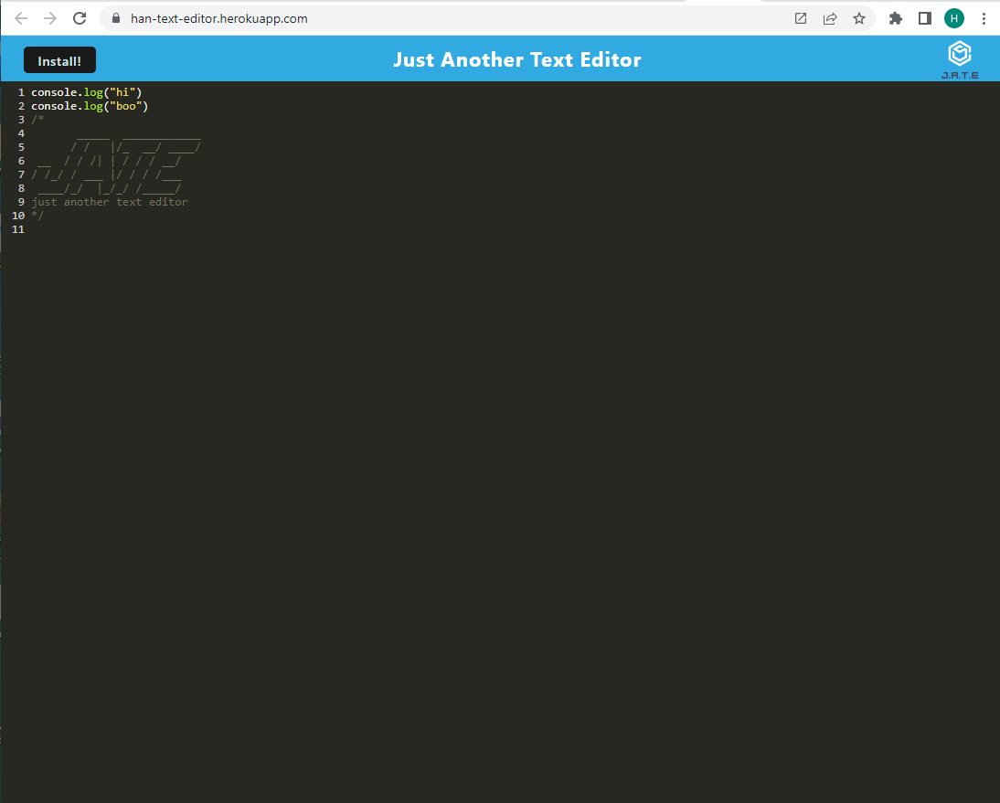
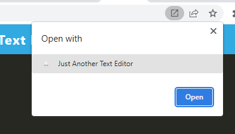
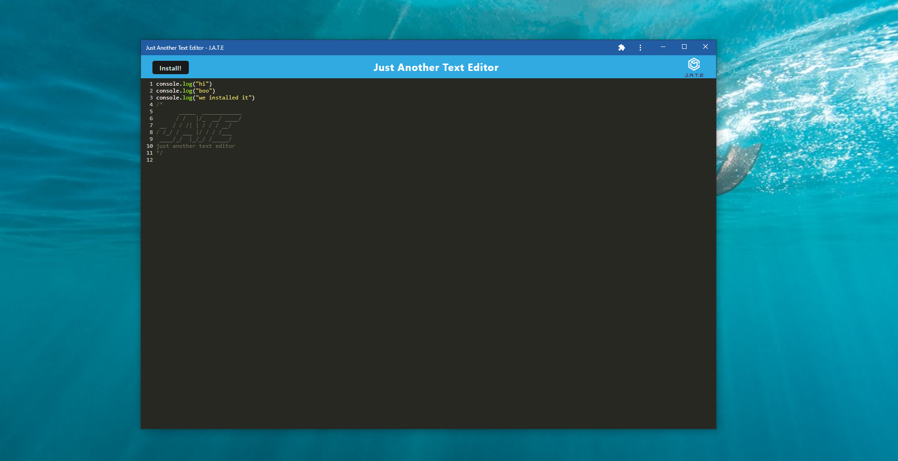
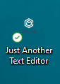

# Text Editor (Refactor)

## Description
Refactor of an existing text editor application, so that it can be install as a progressive web application and used offline.

## Table of Contents

- [Screenshots](#screenshots)

- [Link](#link)

- [License](#license)

- [Contact](#contact)

- [Acknowledgements](#acknowledgements)

## Screenshots
Deployed webpage:

Opened with the installed application:

Application icon:

## Link
Link to deployed application:

https://han-text-editor.herokuapp.com/

## License
This project is covered under the MIT license.

For more information see: 
https://opensource.org/licenses/MIT

## Contact
You can direct any questions or feedback you have to:

Email: peterson.hj@outlook.com

GitHub: https://github.com/hannahj25

## Acknowledgements
Modified from an existing application; starting code provided by the University of Adelaide's Coding Boot Camp.

